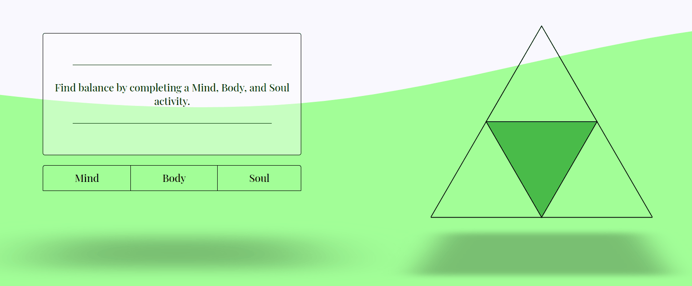
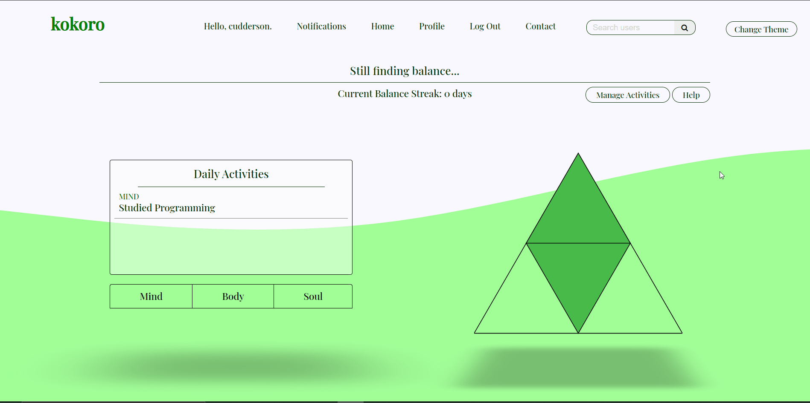

### kokoro is a wellness tool focused around the mind, body and soul.

### Live: [getkokoro.herokuapp.com](getkokoro.herokuapp.com)

#

# About

## Find Balance
### The main goal of kokoro is to improve the lives of its users by organizing their daily activities, classifying each into the mind, body, or soul category.

#

### To 'find balance' is to complete the pyramid by submitting an activity of each type. (Activities reset daily)

#

## Additional Features
### - User Profile Page
- Profile Image / Avatar
- Profile Quote
- Perfect Balance / Your favorite activities
- Fully-Customizable
### - Friendships
- Add / Remove friendships with other kokoro users
### - Write, Edit, and Share kokoro Posts
- Posts on kokoro are similar to blog posts
- Pin Posts from other kokoro users to your profile
### - Notifications
- Receive notifications when friends publish a Post, pin your Posts to their profile, or when you receive a friendship request
### - Contact / Support Page
- Fill out a form to contact kokoro with any app-related issues
### - Alternate Color Theme
- The 'Change Theme' button will toggle kokoro's alternate color theme for users who don't prefer the main theme

## Built With
- Django 3.1.7
- Python 3.8
- MySQL

